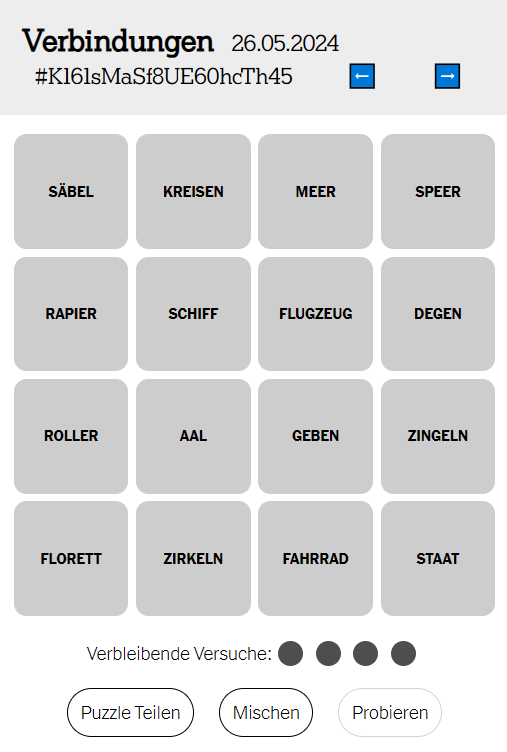
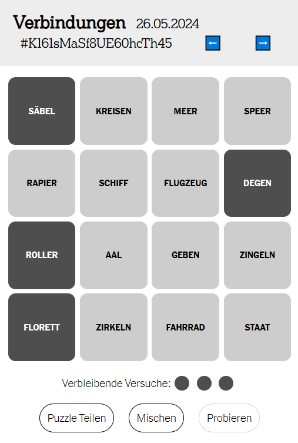
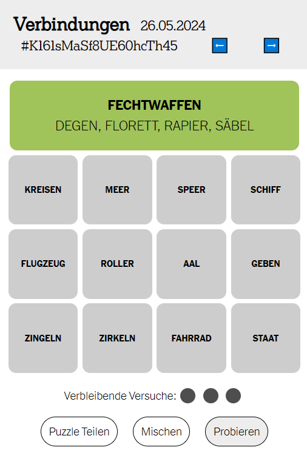
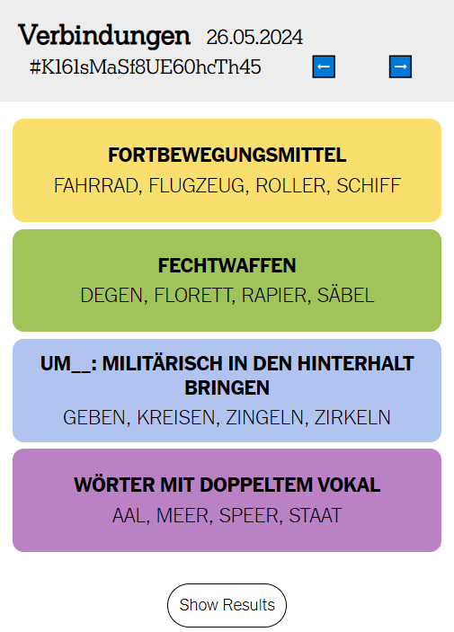
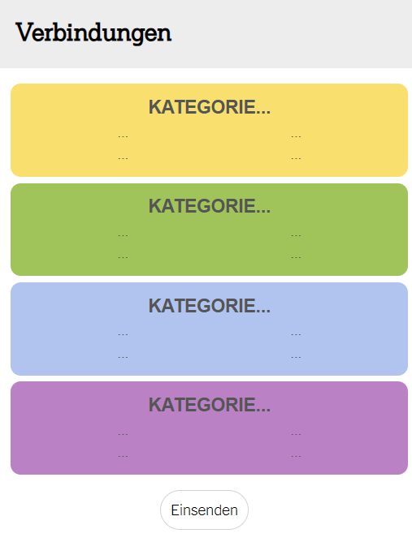
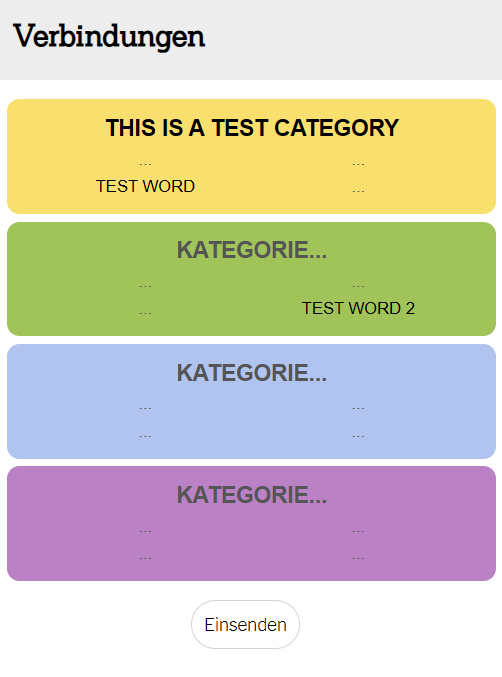

# NYT Connections in German

Try it out at [verbindungen-game.web.app](verbindungen.obrhubr.org).

This site is a clone of the popular puzzle published by the New York Times, [Connections](https://www.nytimes.com/games/connections). The objective of the game is to sort 16 words into four different categories.
The goal was to recreate the game as simply as possible, in pure html, css and javascript (without the help of a framework). This allowed me to build it in about 24h.

## Hosting the site

The original site was hosted on Github Pages, but I wanted to add the possibility for my friends to add puzzles too, so I switched to Firebase. You can still view original version at [this commit](https://github.com/obrhubr/nyt-connections-deutsch/commit/3dcf06776e84c31baf2b9e6707b7c44de7ca71ac).

Using Firebase allowed me to add a few very important features. First is the loading of puzzles from a database (specified by an ID encoded in the URL parameter, allowing simple navigation) and of course the possibility of creating and uploading a new puzzle directly from a webpage (see creating new puzzles [here](#Creating-new-Puzzles)).

## Playing connections

When first loading the site you are presented with the blank grid of 16 words of today's puzzle. You can then select different words and check if you were able to correctly identify a category.

The title bar shows the ID of the current puzzle and also the date of creation. This allows users to easily share the puzzle with others, through URL parameters: `verbindungen-game.web.app/?number=K161sMaSf8UE60hcTh45` links to that puzzle directly.
It is also possible to navigate between the puzzles in chronological order with the arrow buttons. They call the Firestore API to fetch the puzzle id and reload the page with the correct URL parameter.

| Initial State | Selected words |
:-------------------------:|:-------------------------:
 |  |
| Solved first category | Reveal |
 |  |

At the end you are prompted with a popup showing the steps you took to reach the end of the game and a button that allows you to copy this short message, enabling you to share it with friends.

```
Verbindungen Puzzle: K161sMaSf8UE60hcTh45
🟩🟨🟨🟪
🟩🟨🟩🟩
🟩🟩🟩🟩
🟦🟦🟨🟦
🟦🟦🟦🟪
🟪🟨🟪🟪
verbindungen-game.web.app/?number=K161sMaSf8UE60hcTh45
```

## Creating new Puzzles

A second page under `/add` allows the user to sign in with credentials, powered by the Firebase authentification service. Only certain users are allowed to upload puzzles, restricting the access.

Once the correct username and password have been provided the user can fill out category names and the corresponding words and upload the puzzle at the end.

| The puzzle creation screen | A few words filled in |
:-------------------------:|:-------------------------:
 |  |


## Analytics

Firebase allows us to send custom events, that track the users progress with the puzzle.
We identify the user with a specific UUID at the beginning of the session.

When the user makes a mistake or category an event with the puzzle id and user id is sent. At the end of the game a summary with the mistakes and puzzle id is sent to the server.

This allows us to track which categories are harder or are solved first for example.
